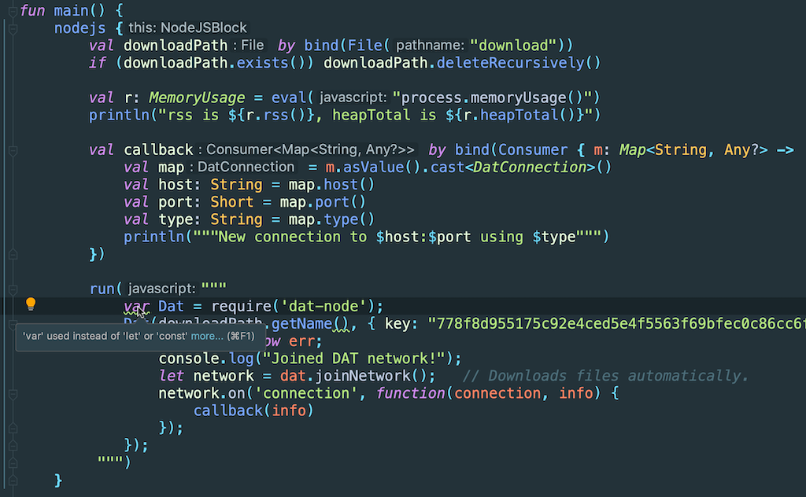

# Language injection

IntelliJ offers "language injection", which means a file can contain multiple languages at once. 
To benefit from this you unfortunately have to flip a switch in the IDE settings:

1. Open your preferences and go to `Editor > Language Injection > Advanced`
2. Under "Performance" select "Enable data flow analysis"

Any string passed to `eval` will now be highlighted and edited as JavaScript, not a 
Java/Kotlin/Scala/etc string literal. Like this:

!!! question

    If the feature doesn't seem to work, make sure you aren't passing the string through some other
    function first. Kotlin multi-line strings often get a `.trimIndent()` appended automatically,
    which is unfortunately sufficient to break the dataflow analysis and stop IntelliJ recognising
    that the language of the string hasn't changed. You can just take it out: JS isn't sensitive
    to leading whitespace.